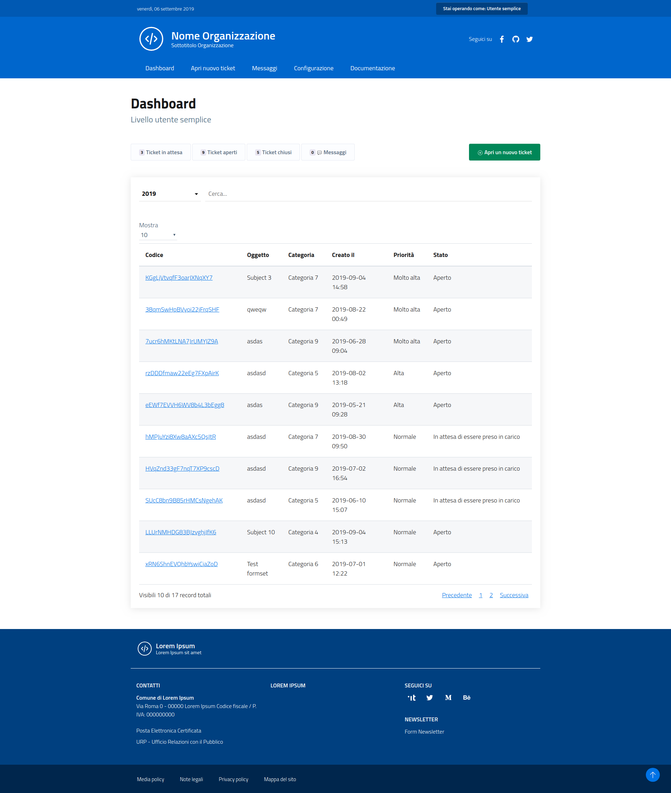
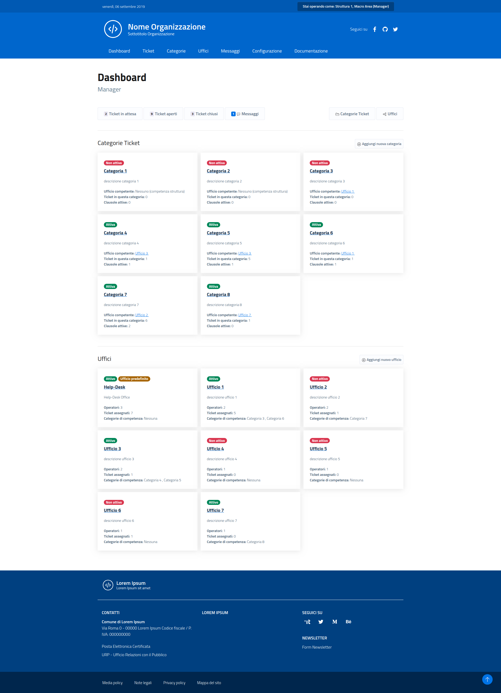

uniTicket
---------

Django **Unified Ticket System** è un sistema software di ticketing ed helpdesk per il tracciamento e la digitalizzazione dei flussi di richieste e documentali.

Principali caratteristiche:

- Multi Tenant. Un unico sistema a supporto di diversi uffici e aree organizzative;
- Possibilità di trasferire e condividere ticket tra differenti uffici/aree;
- Possibilità di aggiungere clausole di consenso da accettare prima di aprire un ticket;
- Interdipendenza tra ticket;
- Lista di attività atomiche per ogni ticket, per guidare l'utente nel processo di lavorazione ed evasione;
- Form builder, possibilità di creare i moduli di inserimento per ogni categoria di ticket;
- Campi di input personalzzati, campi complessi e Django Formsets configurabili tramite widget;
- Gestione allegati firmati digitalmente (PDF e P7M), con controllo e validazione dell'integrità dei dati;
- Report di riepilogo via email che include la lista dei ticket pendenti agli operatori;
- JQuery Datatables integrato, per una gestione Ajax con processamento lato server dei dati, per ottime performance;
- Template grafico reponsive per una esperienza di navigazione ottimale anche sui dispositivi mobili;
- Integazione SAML2 SSO (pySAML2);
- Pienamente rispondente alle linee guida AGID per le interfacce grafiche.

[Documentazione ufficiale](https://uniticket.readthedocs.io/it/latest/index.html) su **readthedocs** per installazione e utilizzo del software.

uniTicket
---------

Django **Unified Ticket System** Is a support software that let us manage tickets and generic submission modules with our user.
Featurset:

- Multi Tenant. Multiple office and organizational areas support in a single, unified, system;
- Possibility to transfer and share tickets between different office/areas;
- Possibility to add data consent or agreement submission before a ticket being created;
- ticket interdependencies;
- todo list for every ticket, to follow user to do things before submission;
- Custom fields, custom complex field, custom multi row (table) fields with configurable fancy widgets;
- Pdf and p7m signed fields, with validation on data integrity (attachment);
- Report summary via email about pending tickets to office's operators;
- datatables ajax server side processing, very good performances on mobile device;
- Responsive template for a better mobile experience;
- SAML2 SSO integration (pySAML2);
- Fully compliant Agid visual guidelines.

Consult the [Official Documentation](https://uniticket.readthedocs.io/it/latest/index.html) at readthedocs for usage specifications and advanced topics.

Gallery
-------

_**Image 1:** Example of user dashboard_

_**Image 2:** Example of manager dashboard_
