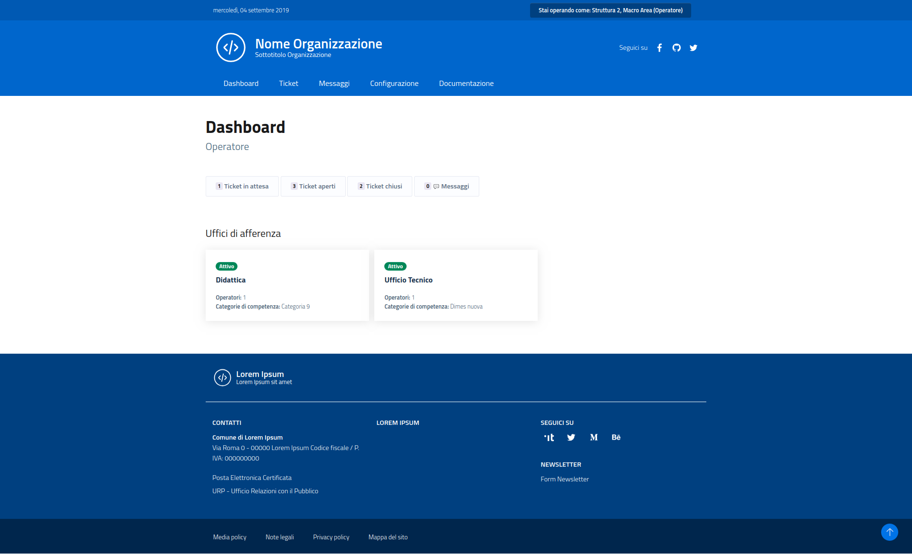

# Operatore

* Gestisce il workflow dei ticket collegati agli uffici a cui afferisce.
* Come il manager, può definire per questi nuove assegnazioni, creare attività e aggiornare lo stato.
* Se assegnato all”Ufficio predefinito della struttura può gestire tutti i ticket della struttura.
* Non ha alcuna facoltà sull’organizzazione di categorie e uffici.

## Dashboard

A differenza degli utenti Manager, un Operator non ha i privilegi per gestire Uffici e Categorie.  
La sua Dashboard consente l’accesso alle liste di ticket e visualizza un riepilogo degli uffici a cui l’utente è assegnato.

