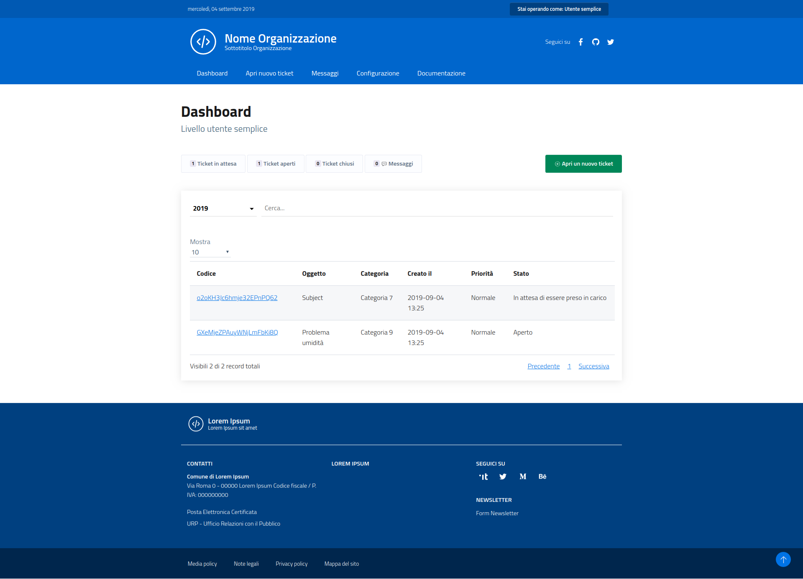

# Utente

* Può aprire nuovi ticket e consultarne i dettagli.
* Può modificare o eliminare un ticket prima che questo venga preso in carico e può chiuderlo in qualsiasi momento.
* Durante la “vita” del ticket, può interagire con gli operatori mediante il pannello di messaggistica dedicato.
* Non ha i permessi per l’interazione con le funzionalità gestionali.

## Dashboard

Un utente utilizzatore nella dashboard visualizza il riepilogo di tutti i suoi ticket (in qualsiasi stato), ordinati per priorità decrescente.

