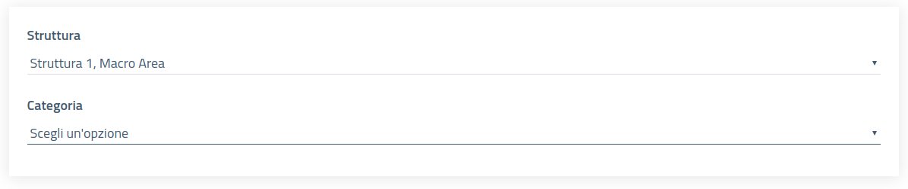

# Gestione dei ticket

## Apertura nuovo ticket

L’apertura di un nuovo ticket presuppone la scelta della struttura di destinazione e di una tipologia di richietsa. La tipologia deve essere attiva e accessibile dall’utente in base ai ruoli definiti.

Una volta scelti questi due parametri, all’utente viene presentato il modulo di input definito dal manager della struttura per quella particolare categoria.

## Modifica

Un utente utilizzatore può modificare un ticket esclusivamente se questo non è stato assegnato.  
La modifica può interessare qualsiasi dettaglio del ticket.  

## Chiusura

In qualsiasi momento l’utente utilizzatore può chiudere uno dei suoi ticket (senza tener conto di eventuali dipendenze associate), a meno che questo non si trovi già in stato “Chiuso”.

Questa funzionalità risulta essere utile nel caso in cui l’utente si dovesse rendersi conto che la sua richiesta è stata già soddisfatta diversamente o nel caso di richieste errate.

## Eliminazione

Come per la modifica, un utente può eliminare i suoi ticket se questi non sono stati ancora presi in carico.