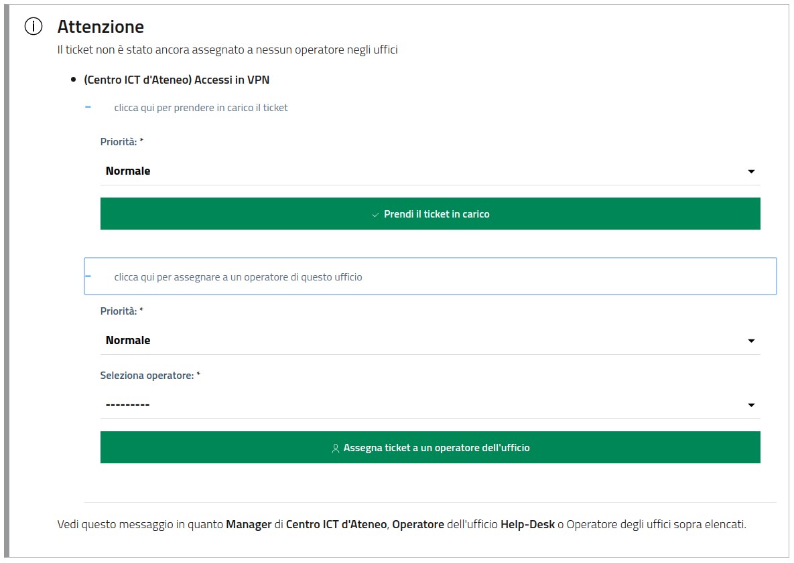
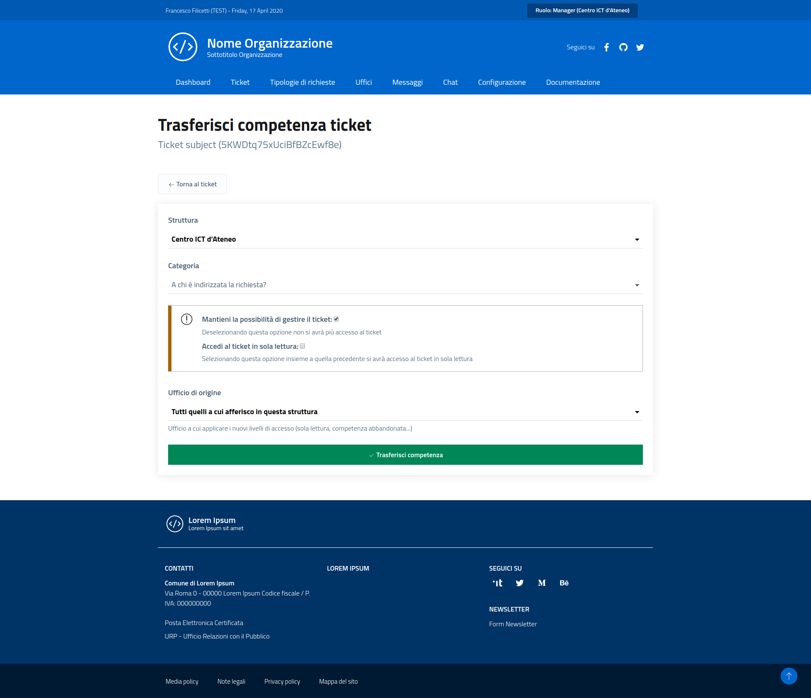
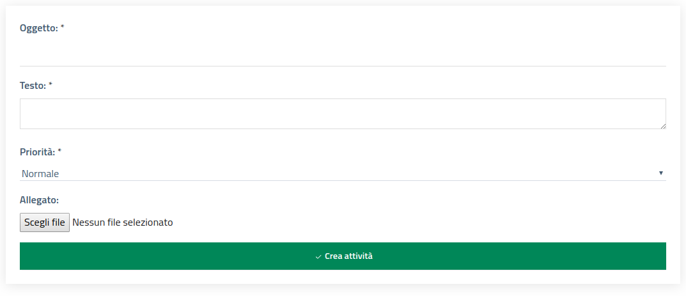
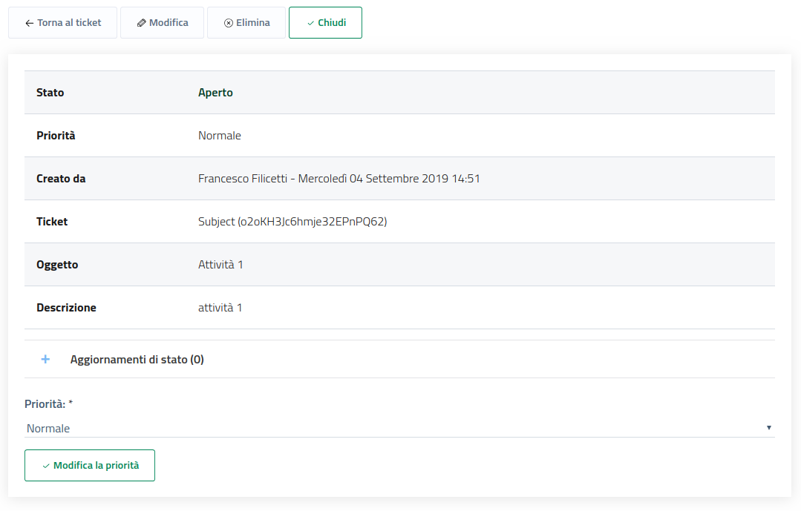
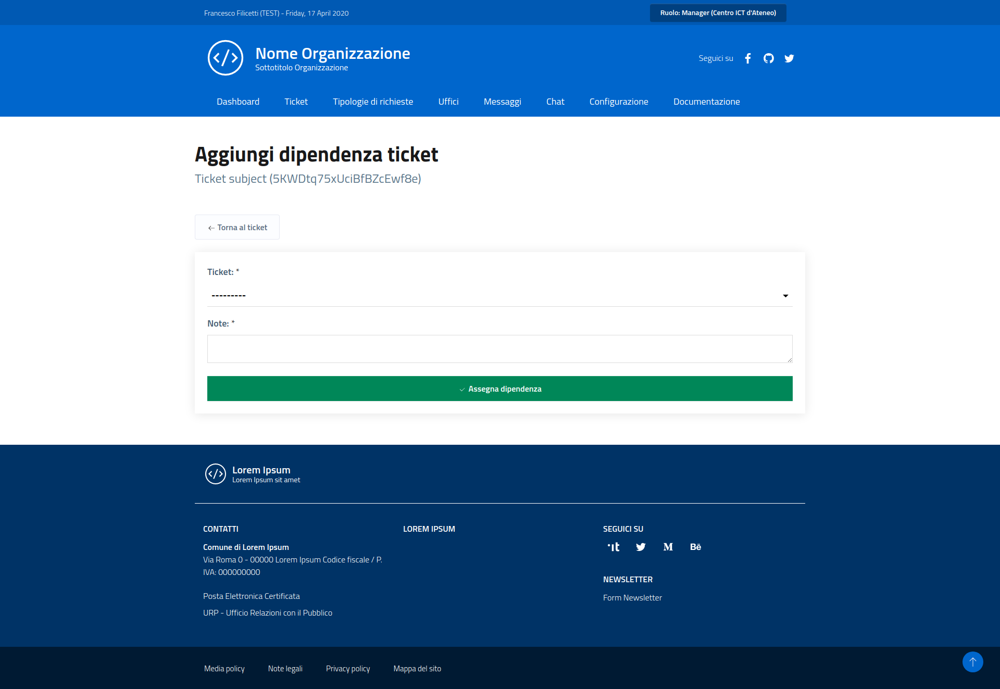

# Gestione

La gestione del workflow di una richiesta prevede strumenti utilizzabili sia dagli utenti **Manager** che dagli **Operatori**.

## Presa in carico e impostazione priorità

La prima operazione da effettuare per la gestione di una richiesta è la presa in carico, ovvero l’assunzione della responsabilità di gestione.  
All’atto di questo aggiornamento di stato, all’utente operatore viene chiesto di scegliere il livello di priorità da assegnare alla richiesta, in modo da posizionarlo correttamente nella lista delle richieste aperte.

!!! info "Informazione"
    Un utente manager può, in questa fase, assegnare la richiesta a un operatore dell’ufficio competente.

## Dettaglio richiesta

La schermata di dettaglio fornisce tutte le informazioni necessarie, oltre a un set di strumenti di gestione.
Oltre alla scheda dettagliata, è presente una lista con tutte le operazioni effettuate sulla richiesta, accompagnate dalla data e dall’utente responsabile.
E’ disponibile l’elenco delle attività collegate alla richiesta e quello delle richieste da cui esso dipende.

## Aggiornamento priorità

In qualsiasi momento della vita della richiesta è possibile aggiornare la sua priorità.

## Gestione competenza uffici

E’ possibile abbandonare o condividere la competenza della richiesta con altri uffici, per motivi organizzativi e gestionali, o scegliere di trasferirla scegliendo di:

* abbandonare completamente i propri privilegi di gestione della richiesta;

* mantenere ancora l’accesso ma in sola lettura.

## Attività della richiesta

L’aggiunta, la gestione e la cancellazione delle attività della richiesta può essere effettuata con molta flessibilità finché essa si trova in stato «Assegnata».

!!! warning "Attenzione"
    Attività non chiuse impediscono la chiusura della richiesta.

## Dipendenze da altre richieste

Un operatore può assegnare o rimuovere una dipendenza, scegliendo tra le richieste che sono sotto la sua responsabilità.  
Questo crea un legame forte, come per le attività, che impedisce alla richiesta in oggetto di essere chiusa finchè tutte le sue dipendenze attive non sono chiuse.

